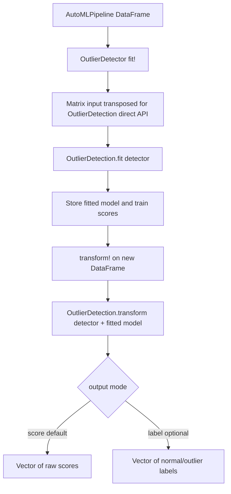

## Goal Capsule

- **Objective:** Add a native AutoMLPipeline-compatible wrapper for `OutlierDetection.jl` detectors, using `fit`, `fit!`, `transform`, and `transform!` dispatch without MLJ `machine` wrappers.
- **Authority:** User scope and the existing AutoMLPipeline `fit!` / `transform!` contract outrank library convenience APIs.
- **Execution profile:** Small feature in the existing anomaly-detection module surface; keep the diff local to AutoAD unless implementation proves root exports are required.
- **Stop conditions:** Wrapper trains a real OutlierDetection detector, returns scores through `transform!`, supports non-mutating `fit` / `transform`, and passes targeted AutoAD tests.

---

## Product Contract

### Summary

AutoAD already has Python-backed anomaly wrappers (`SKAnomalyDetector`, `CaretAnomalyDetector`) that follow AutoMLPipeline's `fit!` / `transform!` shape.
This plan adds a native Julia wrapper for `OutlierDetection.jl` detectors so anomaly pipelines can use OutlierDetectionJL models without going through MLJ `machine`, `fit!`, `transform`, or `predict` wrappers.

### Problem Frame

OutlierDetectionJL exposes two useful integration surfaces: an MLJ-facing surface and a direct native interface.
The user explicitly rejected the MLJ wrapper path, so the plan targets the direct API: convert AutoMLPipeline `DataFrame` inputs into the column-major matrix shape expected by OutlierDetectionJL, call `OutlierDetection.fit(detector, matrix; kwargs...)`, store the returned model and train scores, and call `OutlierDetection.transform(detector, fitted_model, matrix)` for new data.

### Requirements

- R1. Provide an AutoMLPipeline `Machine` subtype wrapper for OutlierDetectionJL detectors with `fit!`, `fit`, `transform!`, and `transform` methods.
- R2. Do not use MLJ `machine`, MLJ model loading, or MLJ `predict` / wrapper detectors in the integration.
- R3. Preserve current AutoAD wrapper style: mutable struct with `name::String`, `model::Dict`, keyword/dict constructors, and fit/transform overloads imported from `AMLPipelineBase.AbsTypes`.
- R4. Return raw outlier scores by default so downstream users can decide their thresholding policy.
- R5. Support optional label output using OutlierDetectionJL score helpers, without making labels the default.
- R6. Keep the new dependency surface local to AutoAD unless implementation discovers root-package exports are required.
- R7. Add tests that train a real OutlierDetectionJL detector and verify mutating and non-mutating API behavior.

### Scope Boundaries

- In scope: native direct API integration for OutlierDetectionJL detectors, AutoAD exports, focused tests, and a short docs/example update.
- Out of scope: MLJ `machine` integration, `@load` / `@iload` detector discovery, hyperparameter tuning, model persistence, MLFlow wiring, or replacing existing scikit/caret anomaly detectors.

### Sources & Research

- `AutoAD/src/skanomalydetector.jl` and `AutoAD/src/caretanomalydetector.jl` show existing anomaly wrapper shape and Vector-returning terminal behavior.
- `AutoAD/src/AutoAD.jl` is the existing anomaly module export hub.
- `docs/src/tutorial/extending.md` and `README.md` define the AutoMLPipeline extension contract: `DataFrame` inputs and `fit!` / `transform!` overloads.
- OutlierDetectionJL docs and source show native direct usage: `fit(detector, Matrix(X)')` returns a fitted model and training scores; `transform(detector, model, Matrix(X)')` returns scores for new observations.
- OutlierDetectionJL docs also show helpers such as `scale_minmax`, `classify_quantile`, and `outlier_fraction`; only `classify_quantile` is relevant for optional label output.

---

## Planning Contract

### Key Technical Decisions

- KTD1. Put the wrapper in AutoAD, not root AutoMLPipeline. AutoAD is already the anomaly-detection package in this repo, and adding OutlierDetection dependencies to root AutoMLPipeline would make all users pay for anomaly-specific packages.
- KTD2. Use OutlierDetectionJL direct API only. The user explicitly said not to use the MLJ wrapper, and direct API is smaller: one `fit` call, one `transform` call, stored fit result.
- KTD3. Treat the wrapper as a terminal `Learner` even though training is unsupervised. Existing anomaly wrappers already use `<: Learner` and ignore the target vector, so this preserves pipeline behavior and Vector outputs.
- KTD4. Default output is raw scores. Outlier thresholds are domain-specific, and OutlierDetectionJL defines scores as increasing with outlierness; default thresholding would hide an important modeling choice.
- KTD5. Add one concrete detector package for tests only if needed by real integration. `OutlierDetection.jl` provides the interface and helpers; actual detectors live in subpackages such as `OutlierDetectionNeighbors.jl`, so tests need one real detector source.

### High-Level Technical Design

### Assumptions

- OutlierDetectionJL direct API remains available through `OutlierDetection.fit` and `OutlierDetection.transform` for detector objects supplied by detector subpackages.
- AutoAD package tests are the right home for the integration tests.
- Root `AutoMLPipeline.jl` does not need to reexport the new wrapper unless implementation discovers documented root-level anomaly exports.

### Deferred to Implementation

- Exact wrapper type name may be `OutlierDetector` or `ODDetector`; prefer the clearer name unless it conflicts with imported identifiers.
- Exact supported output-mode symbols should match the smallest obvious set discovered during implementation, likely `:score` and `:label`.

---

## Implementation Units

### U1. Add AutoAD dependency and module export wiring

- **Goal:** Make native OutlierDetectionJL APIs available inside AutoAD and expose the wrapper through the existing AutoAD module surface.
- **Requirements:** R1, R2, R3, R6.
- **Dependencies:** None.
- **Files:** `AutoAD/Project.toml`, `AutoAD/src/AutoAD.jl`.
- **Approach:** Add `OutlierDetection` to AutoAD dependencies. Add one concrete detector dependency such as `OutlierDetectionNeighbors` only if the tests or a default constructor require a bundled detector. Include a new wrapper source file from `AutoAD/src/AutoAD.jl` and export only the wrapper plus any listing/helper function that earns its keep.
- **Patterns to follow:** `AutoAD/src/AutoAD.jl` include/export blocks for `SKAnomalyDetectors` and `CaretAnomalyDetectors`.
- **Test scenarios:** Test expectation: none -- this unit is package/module wiring; U3 proves it through import and real wrapper usage.
- **Verification:** `using AutoAD` exposes the new wrapper without breaking existing anomaly exports.

### U2. Implement native OutlierDetection wrapper

- **Goal:** Add a small wrapper that adapts AutoMLPipeline `DataFrame` inputs to OutlierDetectionJL direct detector calls.
- **Requirements:** R1, R2, R3, R4, R5.
- **Dependencies:** U1.
- **Files:** `AutoAD/src/outlierdetector.jl`, `AutoAD/test/test_outlierdetector.jl`.
- **Approach:** Define a mutable wrapper subtype consistent with existing anomaly detectors, storing detector object, fit kwargs, transform/output options, fitted model, and train scores in `model::Dict`. `fit!` should ignore the target vector, convert `DataFrame` to the direct API matrix orientation, call `OutlierDetection.fit`, and store both fit result and training scores. `fit` should match existing wrapper convention: call `fit!` and return a deep-copied fitted object. `transform!` should call direct `OutlierDetection.transform` with the stored fit result and return a `Vector` of scores by default. Optional label mode should apply an OutlierDetection helper based on stored train scores rather than invoking MLJ prediction.
- **Execution note:** Start with a failing wrapper test for direct score output before adding optional label mode.
- **Technical design:** Directional API shape only: constructor accepts either a detector object or a zero-arg detector factory plus `fit_args` / `transform_args`; `fit!` stores `:detector`, `:fitresult`, and `:scores_train`; `transform!` reads those keys and errors clearly if called before fitting.
- **Patterns to follow:** `AutoAD/src/skanomalydetector.jl` for unsupervised `fit!` signature and Vector output; `src/skpreprocessor.jl` for `fit` returning a deep-copied fitted object.
- **Test scenarios:**
  - Happy path: fit a real detector on a numeric `DataFrame`; `transform!` on the same data returns one score per row and all scores are numeric.
  - `fit` convention: `fit(wrapper, X)` returns a distinct fitted copy and follows existing package behavior for mutating the source wrapper during fitting.
  - Pre-fit error: calling `transform!` before `fit!` raises a clear error instead of failing with a missing-key stack trace.
  - Label mode: with optional label output enabled, `transform!` returns one label per row and labels are limited to OutlierDetection normal/outlier classes or their string equivalents.
  - Shape edge case: a one-column `DataFrame` and a multi-column `DataFrame` both preserve row count in output.
- **Verification:** The wrapper uses `OutlierDetection.fit` / `OutlierDetection.transform` directly; no MLJ `machine`, `predict`, `@load`, or wrapper detector appears in the implementation.

### U3. Add focused AutoAD tests

- **Goal:** Prove native OutlierDetection wrapper behavior without broad AutoAD test churn.
- **Requirements:** R2, R4, R5, R7.
- **Dependencies:** U1, U2.
- **Files:** `AutoAD/test/test_outlierdetector.jl`, `AutoAD/test/runtests.jl`.
- **Approach:** Add one test file and include it from AutoAD's test runner. Use a tiny deterministic numeric `DataFrame` with an obvious extreme row. Use a real OutlierDetectionJL detector from the chosen detector package. Keep assertions structural and semantic: length, numeric scores, finite values, optional label domain, and pre-fit error.
- **Patterns to follow:** `AutoAD/test/test_skanomalydetector.jl` for anomaly test style and `test/test_skpreprocessing.jl` for `fit` vs `fit!` checks.
- **Test scenarios:**
  - `fit_transform!` returns a score vector with `length == nrow(X)`.
  - `fit!` followed by `transform!` matches `fit_transform!` output shape.
  - `fit` followed by `transform` works on the fitted copy and does not require target labels.
  - Optional label output returns one label per row with no unexpected classes.
  - Test source scan or assertion confirms no MLJ wrapper path is used by wrapper source.
- **Verification:** AutoAD tests run with the new file included and existing tests still load.

### U4. Document minimal usage

- **Goal:** Show users how to instantiate an OutlierDetectionJL detector and wrap it in AutoAD.
- **Requirements:** R1, R2, R4, R5.
- **Dependencies:** U2, U3.
- **Files:** `README.md` or `docs/src/index.md`; optionally `AutoAD/README.md` only if implementation finds one exists or creates a package-local docs pattern.
- **Approach:** Add a short example under anomaly detection or extension docs. Show direct detector construction, wrapper construction, `fit!`, and `transform!`. Mention that this integration intentionally does not use MLJ `machine` wrappers, and that raw scores are default.
- **Patterns to follow:** Existing README examples that show `fit!(model, Xtrain, Ytrain)` and `prediction = transform!(model, Xtest)`.
- **Test scenarios:** Test expectation: none -- docs-only unit; U3 covers executable behavior.
- **Verification:** Documentation names the needed package imports and does not suggest MLJ `@load`, `machine`, or `predict` for this wrapper.

---

## Verification Contract

| Gate | Applies to | Done signal |
|---|---|---|
| AutoAD targeted tests | U1-U3 | `AutoAD/test/runtests.jl` includes and passes `test_outlierdetector.jl` with a real OutlierDetectionJL detector. |
| Root package smoke | U1 | `using AutoAD` and existing AutoAD exports still load. |
| No-MLJ wrapper check | U2-U4 | New wrapper source and docs do not call MLJ `machine`, `predict`, `@load`, or `@iload`. |
| Existing regression smoke | U1-U4 | Existing AutoAD anomaly tests still load; any failures are either fixed or explicitly shown unrelated. |

---

## Definition of Done

- New AutoAD wrapper exposes `fit!`, `fit`, `transform!`, and `transform` for OutlierDetectionJL detector objects.
- Wrapper default transform returns raw outlier scores, one per input row.
- Optional label mode is covered or explicitly deferred if the direct helper API proves incompatible with the selected detector.
- Tests cover mutating and non-mutating API paths, pre-fit failure, and direct native detector use.
- Implementation contains no MLJ wrapper path.
- Docs show minimal usage and default score semantics.
- Dead-end experimental code is removed before finishing.
