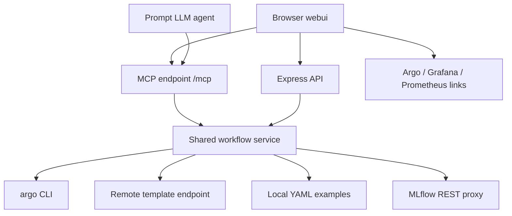
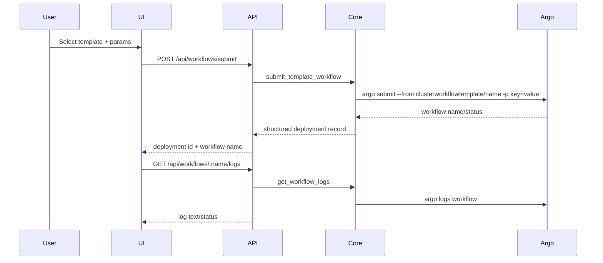
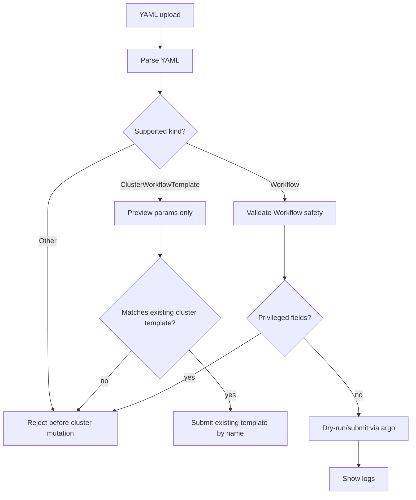

# Argo AutoML Web UI - Plan

## Goal Capsule

| Field | Value |
|---|---|
| Objective | Build `argo-workflow/webui` as a sleek local web app with an embedded MCP server for Argo AutoML workflow deployment, log viewing, YAML workflow submission, MLflow result lookup, and LLM-assisted operations. |
| Authority | User request defines endpoints, `argo-workflow` examples define workflow shapes, and MCP parity findings define agent-safe tool boundaries. |
| Execution profile | Standard software plan with security-sensitive cluster mutation surfaces. Ship safe primitives before broad prompt-agent action. |
| Stop conditions | Stop if Argo CLI, MCP SDK, or MLflow endpoint access cannot be made available from the webui server runtime. |
| Tail ownership | Implementation owns final dependency choices, runtime smoke checks, and exact UI polish while preserving this plan's safety and parity contracts. |

---

## Product Contract

### Summary

Create a polished command-deck website in `argo-workflow/webui` that lets users deploy Argo workflows from remote ClusterWorkflowTemplates, upload supported Argo YAML workflow files, watch deployment logs, query MLflow results, and ask an LLM agent to use MCP tools for the same actions.
The app uses `http://argo.home:8080`, `http://grafana.home:8080`, `http://mlflow.home:8080`, `http://prom1.prometheus.home:8080/metrics`, and `http://argo.isiath.duckdns.org:8080/cluster-workflow-templates` as configured defaults.

### Problem Frame

The repo already has AutoML Argo examples and a broad MCP wrapper in `argo-workflow/agents/argo-k8s.py`, but no dedicated web surface for safe, structured workflow operations.
Raw `argo` and `kubectl` command tools are too broad for a prompt-driven UI, and local YAML examples need to become discoverable deployment options without letting arbitrary Kubernetes resources through.

### Requirements

**Workflow source and parameter handling**

- R1. The web UI lists ClusterWorkflowTemplates from `http://argo.isiath.duckdns.org:8080/cluster-workflow-templates`, with local example YAML files in `argo-workflow` as fallback metadata.
- R2. The UI extracts template parameters and defaults from remote or local YAML so users can edit values before deployment.
- R3. Remote template identity wins over same-named local examples; if remote data lacks parameter/default bodies, same-named local YAML may enrich metadata and must be labeled as local fallback metadata.
- R4. Known AutoML parameters are validated before deployment: positive integer `workers` and `folds`, enum-like `predictiontype` and `complexity`, `.csv` input names without path traversal, and `runid` for prediction templates.

**Deployment and logs**

- R5. The backend submits selected ClusterWorkflowTemplates to the configured Argo namespace using structured operations, not user-composed shell strings.
- R6. The backend accepts uploaded YAML only for Argo `Workflow` submission; uploaded `ClusterWorkflowTemplate` YAML is preview/parameter metadata only unless it matches an existing cluster template name.
- R7. Deployment results appear in a log window that can show status, live or refreshed logs, failure output, and long-log truncation/download behavior.
- R8. The UI prevents accidental duplicate submissions while a deploy request is pending.

**Agent and MCP parity**

- R9. The embedded MCP server exposes first-class tools for template discovery, template submit, YAML submit, workflow listing/status, log retrieval, and MLflow result queries.
- R10. The prompt panel uses the same MCP capability surface as the UI, with current template/workflow context included in agent prompts.
- R11. Mutating prompt-agent actions use safe structured tools, require explicit operator confirmation with rendered parameters, and never route arbitrary user text into raw `kubectl` or `argo` command execution.
- R15. Mutating API and MCP routes are protected by localhost binding, a local bearer token or session secret, and Origin/CSRF checks for browser POSTs.

**Results and observability**

- R12. The backend proxies read-only MLflow experiment/run/metric lookup so browser CORS or in-cluster DNS does not block result display.
- R13. The UI links to Argo, Grafana, MLflow, and Prometheus metrics endpoints for operational context.
- R14. Errors from remote template fetch, YAML parse, Argo submit/logs, MCP, LLM, and MLflow are normalized into actionable UI states.

### Actors

- A1. Operator: picks templates, tunes parameters, submits workflows, watches logs, and inspects results.
- A2. LLM agent: uses MCP tools to deploy workflows and answer questions about workflow status, logs, and MLflow results.
- A3. Backend server: enforces namespace, YAML, parameter, and MCP safety boundaries.

### Key Flows

- F1. Template deploy: user opens UI, selects a remote or fallback template, edits parameters, deploys once, then watches workflow logs.
- F2. YAML deploy: user uploads supported Argo YAML, reviews parsed metadata and parameters, validates with dry-run, then submits.
- F3. Agent operation: user asks the prompt panel to deploy or inspect a run, the LLM calls MCP tools, and the UI shows the answer plus linked deployment state.
- F4. Result lookup: user or agent queries MLflow after a run and sees matching experiments/runs/metrics or a clear pending/no-match state.

### Acceptance Examples

- AE1. Given remote templates are reachable, when the UI loads, then remote template names and parameter defaults appear and local duplicates are marked fallback.
- AE2. Given `automlai-dualsearch` and parameters `workers=20`, `input=iris.csv`, `predictiontype=classification`, when the user deploys, then exactly one Argo workflow is submitted and its logs appear in the log window.
- AE3. Given valid Argo `Workflow` YAML is uploaded, when the user validates and submits it, then the backend dry-runs it before real submission and returns a workflow name.
- AE4. Given YAML with `kind: Secret` or privileged cluster resource shape, when uploaded, then submission is rejected before cluster mutation.
- AE5. Given a workflow has completed and MLflow has matching runs, when the user queries results, then metrics and run metadata are shown through the backend proxy.
- AE6. Given the prompt panel asks to deploy a workflow, when the agent acts, then it uses MCP `submit_template_workflow` or `submit_yaml_workflow`, not raw shell command passthrough.

### Scope Boundaries

- In scope: `argo-workflow/webui` app code, embedded MCP tools, backend API routes, browser UI, YAML upload validation, MLflow read-only proxy, and docs for running the webui.
- In scope: reading existing example templates in `argo-workflow/*.yaml` and command patterns from `argo-workflow/run.sh`.
- Out of scope: changing cluster installation scripts, rewriting `argo-workflow/agents/argo-k8s.py`, multi-user login/authz, and modifying AutoML container images.
- Deferred to Follow-Up Work: first-class MLflow run ID propagation from workflow outputs or labels; initial implementation may correlate by workflow/log/experiment heuristics.

---

## Planning Contract

### Key Technical Decisions

- KTD1. Build `webui` as a minimal Node app with Express, static HTML/CSS/JS, and the official MCP JavaScript SDK. This avoids a frontend build pipeline while still supporting a sleek interactive interface and Streamable HTTP MCP.
- KTD2. Use structured backend functions as the single source for UI API routes and MCP tools. This keeps UI and agent behavior in parity and prevents separate unsafe paths.
- KTD3. Shell out to the existing `argo` CLI for submission/logs in the first version. The repo already uses CLI examples in `argo-workflow/run.sh`, and direct Kubernetes API integration would add more code and dependencies than needed.
- KTD4. Never expose raw mutating `kubectl` or `argo` command execution through the web UI or prompt agent. Mutations go through allowlisted operations with fixed namespace, argument arrays, validation, and structured results.
- KTD5. Treat uploaded YAML as untrusted input. Support real submission only for Argo `Workflow`; uploaded `ClusterWorkflowTemplate` is preview/metadata unless the operator selects an existing cluster template. Reject unrelated Kubernetes kinds, run dry-run/validation where available, and require explicit UI action before submit.
- KTD6. Proxy MLflow through the backend. `http://mlflow.home:8080` may not be browser-CORS-friendly, and the MCP agent needs the same read-only result access.
- KTD7. Load LLM credentials from Pi `~/.pi/agent/models.json` external provider when present, with environment overrides. This keeps the prompt panel aligned with the user's configured ETE endpoint without hardcoding secrets.
- KTD8. Bind to localhost by default and require a local bearer token/session secret for mutating API and MCP calls. This is not full user auth; it is a local safety gate against drive-by POSTs and LAN exposure.
- KTD9. Treat logs, templates, remote metadata, and MLflow text as untrusted prompt data. Redact secrets before display/download excerpts and before any content is sent to the LLM.

### High-Level Technical Design







### Assumptions

- The webui server runs on a machine with working `argo` CLI access to namespace `argo`.
- The remote template endpoint returns either YAML, JSON, or HTML/index content that can be parsed into template names; if it only provides names, local same-name YAML enriches parameters/defaults while remote identity remains authoritative.
- `~/.pi/agent/models.json` exists on the user's machine for ETE credentials, but environment variables remain the portable override path.
- External web research was requested implicitly by endpoint and MCP usage, but web search failed due provider rate limit; this plan uses local repo evidence and known MCP/Argo CLI constraints instead.

### Risks & Dependencies

| Risk | Mitigation |
|---|---|
| Prompt agent mutates cluster beyond user intent | Expose only structured MCP tools; require operator confirmation for every mutating agent tool call. |
| Uploaded YAML runs arbitrary workload | Submit only `Workflow` YAML; validate recursively, reject risky fields, run dry-run, cap size, and require explicit deploy action. |
| MLflow run correlation is incomplete | Provide read-only run search and log-based hints now; defer durable run-id propagation to workflow/template changes. |
| Remote template endpoint shape differs or is poisoned | Implement parser adapters for YAML/JSON/HTML, fall back to local examples, show source badges, prefer HTTPS when configurable, and never let remote defaults override safety constraints. |
| Logs or MLflow data leak secrets | Redact tokens, credentials, Authorization headers, URL credentials, and password-like values before UI excerpts, downloads metadata, and LLM context. |
| Large logs freeze browser | Store bounded cached log excerpts, stream/poll incrementally, and expose download/full-refresh route. |

---

## Output Structure

```text
argo-workflow/webui/
  package.json
  package-lock.json
  README.md
  server.js
  lib/
    argo.js
    llm.js
    mcp.js
    mlflow.js
    templates.js
    yaml.js
  public/
    index.html
    styles.css
    app.js
  test/
    argo.test.js
    llm.test.js
    mcp.test.js
    mlflow.test.js
    templates.test.js
    yaml.test.js
```

---

## Implementation Units

### U1. Create webui shell and configuration

- **Goal:** Establish the `argo-workflow/webui` Node app, static UI shell, default endpoint config, and run documentation.
- **Requirements:** R1, R13, R14
- **Dependencies:** None
- **Files:** `argo-workflow/webui/package.json`, `argo-workflow/webui/package-lock.json`, `argo-workflow/webui/server.js`, `argo-workflow/webui/public/index.html`, `argo-workflow/webui/public/styles.css`, `argo-workflow/webui/public/app.js`, `argo-workflow/webui/README.md`
- **Approach:** Use Express for static hosting and JSON APIs. Keep the frontend dependency-free with a distinctive cockpit design. Put endpoint defaults in environment-readable config surfaced through `/api/config` without exposing secrets.
- **Patterns to follow:** Existing endpoint values from user request; command examples in `argo-workflow/run.sh`.
- **Test scenarios:**
  - Start server with no env overrides and request `/api/config`; expect Argo, Grafana, MLflow, Prometheus, template endpoint, namespace, MCP URL, and redacted LLM status.
  - Override `MLFLOW_URL` and `ARGO_NAMESPACE`; expect `/api/config` to reflect overrides.
  - Load `/`; expect HTML shell to include template picker, YAML upload affordance, logs panel, prompt panel, and observability links.
- **Verification:** App starts locally, serves static assets, and documents run commands plus required CLIs.

### U2. Implement template discovery and parameter metadata

- **Goal:** List remote ClusterWorkflowTemplates and local example templates with parameter/default extraction.
- **Requirements:** R1, R2, R3, R4, AE1
- **Dependencies:** U1
- **Files:** `argo-workflow/webui/lib/templates.js`, `argo-workflow/webui/lib/yaml.js`, `argo-workflow/webui/server.js`, `argo-workflow/webui/public/app.js`, `argo-workflow/webui/test/templates.test.js`, `argo-workflow/webui/test/yaml.test.js`
- **Approach:** Fetch the remote endpoint first with timeout. Parse YAML/JSON responses when possible; parse HTML/index names as best-effort. Read `argo-workflow/*-template.yaml` as fallback metadata. Normalize each template to `{name, source, metadataSource, parameters, defaults, warnings}`; remote identity wins, but same-name local YAML enriches parameters/defaults when remote only provides names. Apply known AutoML validation hints by parameter name.
- **Patterns to follow:** `spec.arguments.parameters` layout in `argo-workflow/automlai-dualsearch-template.yaml` and `argo-workflow/automl-classification-template.yaml`.
- **Test scenarios:**
  - Given YAML for `automlai-dualsearch`, parser returns `url`, `input`, `predictiontype`, `folds`, and `workers` with defaults.
  - Given remote and local templates with same name, list returns one remote-preferred item plus a fallback/stale indicator.
  - Given remote fetch timeout, API returns local examples marked `local` and warning text.
  - Given malformed template YAML, parser skips or returns warning without crashing full list.
  - Given known parameter names, validation metadata includes positive integer and enum/file rules.
- **Verification:** `/api/templates` returns usable metadata for local examples when remote is unavailable and source badges render in UI.

### U3. Add safe Argo workflow deployment service

- **Goal:** Submit existing ClusterWorkflowTemplates and supported uploaded `Workflow` YAML through structured backend operations.
- **Requirements:** R5, R6, R8, AE2, AE3, AE4
- **Dependencies:** U2
- **Files:** `argo-workflow/webui/lib/argo.js`, `argo-workflow/webui/lib/yaml.js`, `argo-workflow/webui/server.js`, `argo-workflow/webui/public/app.js`, `argo-workflow/webui/test/argo.test.js`, `argo-workflow/webui/test/yaml.test.js`
- **Approach:** Implement `submitTemplateWorkflow({templateName, parameters, namespace})` using `spawn('argo', ['-n', namespace, 'submit', '--from', ...])` with argument arrays. Implement `submitYamlWorkflow({yaml, namespace, dryRun})` only for Argo `Workflow` YAML, with size limits, recursive template/pod safety validation, risky-field rejection, temp-file submit or stdin submit, and dry-run where Argo supports it. Uploaded `ClusterWorkflowTemplate` YAML is parsed for preview and can only submit through `submitTemplateWorkflow` when its name already exists in the cluster. Store deployment records keyed by generated id and workflow name.
- **Execution note:** Treat YAML upload as security-sensitive; write rejection tests before enabling real submit.
- **Patterns to follow:** `argo-workflow/run.sh` submit shape; avoid `command.split()` and namespace injection bug seen in `argo-workflow/agents/argo-k8s.py`.
- **Test scenarios:**
  - Covers AE2. Submit template with `workers=20`, `input=iris.csv`, `predictiontype=classification`; spawned args contain one namespace flag and expected `-p` values.
  - Double-click simulation sends two submits while pending; frontend/backend accepts only one active submission for the same request id.
  - Argo submit stderr returns failure; deployment record status becomes `failed` with normalized error.
  - Covers AE3. Valid `Workflow` YAML passes parse and dry-run path before submit.
  - Covers AE4. YAML with `kind: Secret`, `ClusterRole`, privileged container, `hostPath`, `serviceAccountName`, host namespace fields, secret refs, init/sidecar risky specs, or excessive size is rejected before spawn.
  - Uploaded `ClusterWorkflowTemplate` YAML without an existing cluster template match is preview-only and cannot be submitted.
- **Verification:** Deploy routes never accept raw command strings and all cluster-mutating calls use fixed command/argument arrays.

### U4. Implement workflow logs, status, history, and log UI

- **Goal:** Show deployment results in a log window with status, refresh, workflow history, and large-log handling.
- **Requirements:** R7, R14, AE2
- **Dependencies:** U3
- **Files:** `argo-workflow/webui/lib/argo.js`, `argo-workflow/webui/server.js`, `argo-workflow/webui/public/app.js`, `argo-workflow/webui/public/styles.css`, `argo-workflow/webui/test/argo.test.js`
- **Approach:** Add structured operations for `listWorkflows`, `getWorkflow`, and `getWorkflowLogs`. Cache recent deployment records in memory for this local app, poll status/logs from the UI, and show waiting/failure/disconnected states. Keep combined logs first; expose workflow/step metadata so per-step tabs can be added without changing backend shape.
- **Patterns to follow:** Argo CLI `logs`, `get`, and `list` read-only operations; multi-step structure from `argo-workflow/automlai-dualsearch-template.yaml`.
- **Test scenarios:**
  - Pending workflow without pods returns `waiting for pod` style state, not empty success.
  - Failed log command returns normalized retryable/non-retryable error with stderr preserved.
  - Large log response is truncated in UI but full text remains downloadable or refreshable from backend route.
  - Browser refresh can reload recent deployments from backend memory or Argo list.
  - Dualsearch workflow metadata exposes low/high step names when available.
- **Verification:** A successful deploy shows workflow name and logs; failed deploy shows actionable error without starting fake log stream.

### U5. Add MLflow read-only proxy and result panel

- **Goal:** Query MLflow experiments, runs, metrics, and artifacts through backend routes and MCP tools.
- **Requirements:** R12, R14, AE5
- **Dependencies:** U1, U4
- **Files:** `argo-workflow/webui/lib/mlflow.js`, `argo-workflow/webui/server.js`, `argo-workflow/webui/public/app.js`, `argo-workflow/webui/test/mlflow.test.js`
- **Approach:** Implement read-only wrappers for MLflow REST endpoints under `/api/mlflow/*`. Start with experiment search and run search; add run/metric/artifact helpers if endpoint responses support them. Use backend timeout/error normalization and let UI show pending/no-match states.
- **Patterns to follow:** Template MLflow URL parameter defaults in `argo-workflow/*-template.yaml` and user-provided `http://mlflow.home:8080` endpoint.
- **Test scenarios:**
  - MLflow experiment search success renders experiment/run JSON or summarized metrics.
  - MLflow network failure returns retryable normalized error.
  - No matching run for workflow returns clear `no match` state.
  - Dualsearch-like query returns multiple runs without collapsing them.
  - Prediction template missing `runid` is flagged before deployment when template metadata identifies prediction flow.
- **Verification:** MLflow panel can query via backend with browser CORS irrelevant; no write MLflow calls exist.

### U6. Implement MCP server with UI-agent parity tools

- **Goal:** Expose MCP tools that mirror UI operations for template listing, safe deploy, logs, workflow status, YAML submit, and MLflow queries.
- **Requirements:** R9, R10, R11, AE6
- **Dependencies:** U2, U3, U4, U5
- **Files:** `argo-workflow/webui/lib/mcp.js`, `argo-workflow/webui/server.js`, `argo-workflow/webui/test/mcp.test.js`
- **Approach:** Register Streamable HTTP MCP at `/mcp`. Tool handlers call the same service functions used by API routes. Provide structured results with deployment id, workflow name, status, links, parameters, and log excerpts. Exclude raw mutating command tools; keep any diagnostic command support read-only and optional.
- **Execution note:** Implement MCP contract tests with fake services before wiring live `argo` calls.
- **Patterns to follow:** Existing FastMCP intent in `argo-workflow/agents/argo-k8s.py`, but replace raw string command tools with domain primitives from agent-native findings.
- **Test scenarios:**
  - `list_workflow_templates` returns same names/defaults as `/api/templates`.
  - `submit_template_workflow` calls the same submit service as UI route and returns deployment id/workflow name.
  - `submit_yaml_workflow` rejects unsupported kinds before service mutation.
  - `list_workflows` returns recent workflows using the same service contract as UI history.
  - `get_workflow_status` returns phase/status for a workflow name without fetching logs.
  - `get_workflow_logs` returns cached logs by deployment id and live logs by workflow name.
  - `query_mlflow_results` uses read-only MLflow proxy and returns structured JSON.
  - MCP tool schemas reject missing template name or malformed parameter objects.
- **Verification:** MCP inspector or a simple MCP client can list tools and call read-only tools without starting the UI.

### U7. Wire LLM prompt panel to ETE credentials and MCP tools

- **Goal:** Let users ask an LLM agent to deploy workflows or inspect results using the MCP-equivalent tool surface.
- **Requirements:** R10, R11, R14, AE6
- **Dependencies:** U6
- **Files:** `argo-workflow/webui/lib/llm.js`, `argo-workflow/webui/server.js`, `argo-workflow/webui/public/app.js`, `argo-workflow/webui/test/llm.test.js`, `argo-workflow/webui/test/mcp.test.js`
- **Approach:** Load external ETE credentials from `~/.pi/agent/models.json` when available, default model `azure/gpt-5.5`, and allow `OPENAI_BASE_URL`, `OPENAI_API_KEY`, and `OPENAI_MODEL` overrides. Present OpenAI-compatible tool definitions matching MCP primitives. Include selected template, parameters, current workflow, redacted log excerpt, and redacted MLflow summary in prompt context. Treat logs/templates/MLflow as untrusted data. Mutating tool calls from the LLM return a confirmation payload for the operator before execution. Use fallback parser only when no key exists.
- **Patterns to follow:** Pi models config shape from user instruction; MCP tool names from U6.
- **Test scenarios:**
  - With models config present, config route reports model/base URL and `hasKey=true` without exposing key.
  - Prompt asking for template deploy produces an operator confirmation payload with template name, namespace, parameters, and expected Argo args before `submit_template_workflow` runs.
  - Prompt asking for logs calls `get_workflow_logs` with current deployment context and receives redacted excerpts only.
  - Prompt asking for destructive non-supported action is refused.
  - Token, API key, password, Authorization header, and URL-credential strings are redacted before LLM context is built.
  - LLM timeout/error appears as retryable prompt-panel error.
- **Verification:** Prompt panel can answer read-only questions and submit safe workflow operations through shared tool handlers.

### U8. Polish UI states and documentation

- **Goal:** Finish interaction states, visual refinement, docs, and smoke verification for the webui.
- **Requirements:** R13, R14, AE1-AE6
- **Dependencies:** U1, U2, U3, U4, U5, U6, U7
- **Files:** `argo-workflow/webui/public/index.html`, `argo-workflow/webui/public/styles.css`, `argo-workflow/webui/public/app.js`, `argo-workflow/webui/README.md`, `argo-workflow/webui/package.json`
- **Approach:** Keep the cockpit design distinctive but lightweight. Add status badges, source badges, disabled/pending states, YAML validation feedback, log search/copy/download affordances, and endpoint links. Document environment variables, prerequisites, MCP client config, and safe limitations.
- **Patterns to follow:** Frontend-design direction: bold, production-grade, non-generic design; ponytail constraint: no framework unless the plain app cannot support the UX.
- **Test scenarios:**
  - Empty template list shows retry and local fallback explanation.
  - Invalid params disable Deploy and show field-level messages.
  - YAML parser error displays useful line/column when parser provides it.
  - Deployment pending disables duplicate submit and keeps UI responsive.
  - Observability links open configured endpoints.
  - README run instructions work from clean checkout after `npm install`.
- **Verification:** Manual browser smoke covers template list, param edit, YAML upload validation, deploy route with mocked or live Argo, logs refresh, MLflow query, and prompt panel error/success states.

---

## Verification Contract

| Gate | Applies to | Done signal |
|---|---|---|
| Syntax checks | U1-U8 | `node --check` passes for all authored `.js` files. |
| Unit tests | U2-U7 | Node test suite passes for template parsing, YAML validation, Argo command argument construction, MCP tool handlers, MLflow proxy, and LLM config loading. |
| Server smoke | U1, U2, U6 | Local server starts bound to `127.0.0.1` by default; `/api/config`, `/api/templates`, and `/mcp` initialize without crashing. |
| Safe mutation smoke | U3, U6, U7 | Template submit uses argument-array `argo` call with fixed namespace; mutating API/MCP requests require token/Origin checks; YAML rejection tests prove unsupported Kinds never spawn Argo; LLM mutations require operator confirmation. |
| Browser smoke | U1, U4, U5, U7, U8 | UI loads, fields render, invalid params block deploy, logs panel updates, MLflow panel handles success/failure, prompt panel handles LLM unavailable and available states. |
| Live cluster smoke | U3, U4, U5 | If cluster access is available, submit a low-cost known template and verify workflow name, logs, and MLflow lookup behavior. |

---

## Definition of Done

- All code for the feature lives under `argo-workflow/webui`.
- UI and MCP use the same backend service functions for template listing, template submit, YAML submit, logs, workflow status, and MLflow queries.
- Uploaded YAML cannot submit unsupported Kubernetes resources, uploaded `ClusterWorkflowTemplate` definitions, or risky pod specs.
- Mutating API and MCP routes bind locally by default and require local token/session plus browser Origin/CSRF checks.
- Prompt-agent path uses ETE/OpenAI-compatible credentials when configured, redacts untrusted context, and requires operator confirmation for every mutating tool call.
- Local examples are discoverable fallback metadata and clearly labeled when remote templates are unavailable or preferred.
- README documents install/run, endpoint overrides, MCP client URL, LLM credential source, Argo CLI prerequisite, and known limitations.
- Tests and smoke checks from the Verification Contract pass, or any skipped live-cluster check is documented with the missing prerequisite.
- Dead-end experimental code and raw command passthrough paths are removed before handoff.

---

## Sources & Research

- `argo-workflow/run.sh` shows existing `argo -n argo submit --from clusterworkflowtemplate/... -p ... --watch --log` usage.
- `argo-workflow/automlai-dualsearch-template.yaml` shows ClusterWorkflowTemplate parameters, parallel low/high complexity steps, S3 CSV input, and output artifact naming.
- `argo-workflow/automl-classification-template.yaml` shows MLflow URL defaults and known AutoML parameter names.
- `argo-workflow/agents/argo-k8s.py` shows existing MCP/Kubernetes wrapper patterns and risks: raw mutating tools, global context/namespace state, namespace detection bug, and `command.split()` fragility.
- Security review added localhost binding, local token/session, Origin/CSRF, prompt confirmation, recursive YAML safety validation, and redaction as required plan constraints.
- Agent-native review identified required MCP parity tools and safety boundaries for prompt-driven deployment.
- Flow analysis identified edge cases for remote fallback, YAML upload, duplicate deploy, logs, prompt-agent context, and MLflow correlation.
