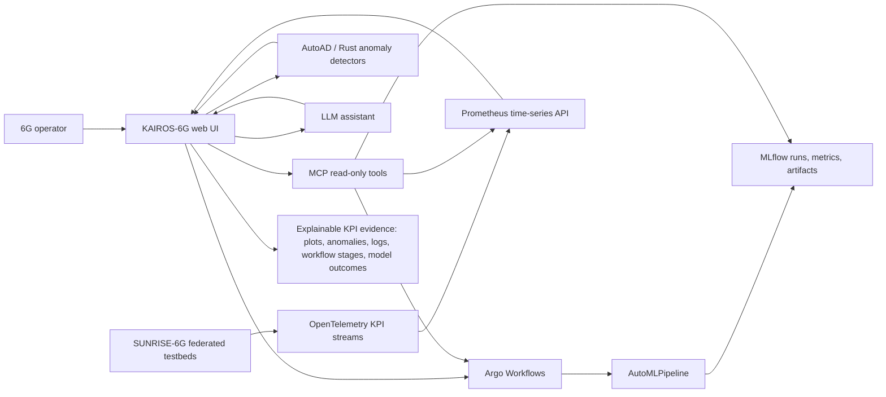

# KAIROS-6G Abstract

KAIROS-6G — KPI-Aware Intelligent Reasoning for Operations and SUNRISE-6G — provides an explainability layer for SUNRISE-6G experimentation by connecting Argo Workflows, AutoMLPipeline, AutoAD, MLflow, OpenTelemetry KPI streams, LLM reasoning, and MCP tool access into one operator-facing command deck. SUNRISE-6G aims to deliver a pan-European 6G experimentation facility with federated testbeds, vertical use-case deployment, decentralised management, CAMARA API integration, testbed onboarding, and ML/Ops-driven native AI for intent-driven lifecycle management. KAIROS-6G focuses on explainable experiment operations: helping operators identify likely causes of KPI deviations during and after federated experiment runs, correlate anomalies with active workflow stages, and preserve evidence for post-experiment review.

Argo Workflows acts as the execution plane. Operators select AutoMLPipeline workflow templates, provide parameters, submit runs, and inspect workflow status or logs through explicit UI controls. AutoMLPipeline performs automated model search and training for 6G experiment tasks, while AutoAD provides anomaly detection over OpenTelemetry-derived KPIs such as CPU usage, memory pressure, network throughput, latency, and service-level probe metrics. OpenTelemetry emits the KPI signals; Prometheus is the time-series query source used by KAIROS-6G for plotting. KAIROS-6G annotates plots with anomaly markers from fast Rust-native detectors for interactive previews and AutoAD-backed detector configurations for deeper analysis.

MLflow acts as experiment memory. It stores AutoML runs, parameters, metrics, artifacts, and outcomes, allowing each workflow execution to be linked back to model quality, training configuration, and experiment history. This lets KPI anomalies be interpreted not only as infrastructure events, but also in relation to active machine-learning workflows, model runs, and resource-intensive pipeline stages.

The LLM assistant provides explainability across these sources. KAIROS-6G first builds deterministic evidence: selected plots, anomaly timestamps, detector settings, workflow logs, Argo workflow metadata, MLflow experiment data, selected template parameters, and testbed or vertical labels when available. The LLM then summarizes that evidence, compares overlapping anomalies across plots, distinguishes correlation from causation, and labels likely causes as hypotheses unless shared identifiers or timestamp alignment provide stronger support. MCP provides a controlled read-only tool interface for evidence gathering; workflow submission and parameter changes remain explicit operator actions outside the agent tool path unless a future approval-gated write mode is added.

For SUNRISE-6G, this architecture supports explainable operations across federated 6G experimentation: KPI anomalies can be tied to workflow activity, AutoML behavior, MLflow outcomes, and infrastructure signals. Federation context is part of the explanation contract: site or testbed identity, vertical use-case labels, ownership boundaries, and experiment identifiers should travel with telemetry and workflow metadata so operators can compare behavior across facilities. CAMARA integration and onboarding support are contextual SUNRISE-6G alignments unless specific UI behavior is added for them.

Security and trust boundaries are first-class requirements. Workflow submission, log access, MLflow access, telemetry inspection, LLM context construction, and MCP tool calls require authentication, role-based authorization, tenant or testbed scoping, and audit logging. Logs, parameters, artifacts, telemetry, and prompts must be minimized and redacted before display or LLM submission; secrets must not be stored in browser state, logs, or model context. LLM/MCP integrations must use allowlisted read-only operations, prompt-injection-resistant context handling, source attribution, and clear denial of out-of-scope tools.

The operator interaction flow is: choose a workflow or time range, inspect KPI plots and anomaly markers, select a marker or plot window, review linked workflow and MLflow evidence, ask for an explanation, then record or export the explanation for triage or experiment reporting. KAIROS-6G should support keyboard navigation, responsive layouts, readable logs, accessible plot inspection, and anomaly indicators that do not rely on color alone.
